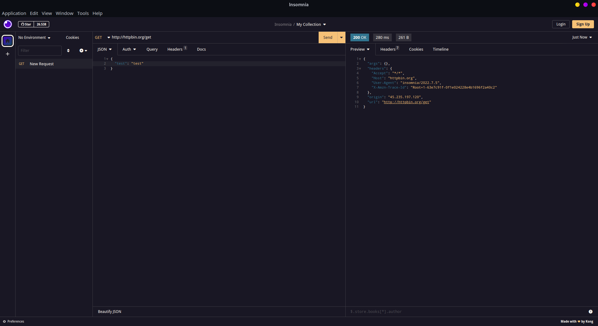

<p align="center">
  
  <h2 align="center">Rosé Pine Theme</h2>
</p>

<p align="center">All natural pine, faux fur and a bit of soho vibes for the classy minimalist for insomnia.</p>

> A dark theme for [Insomnia](http://insomnia.rest)



## Install

```bash
# Clone this repository
$ git clone git@github.com:samsepi0ldev/insomnia-plugin-rose-pine.git

1. In Insomnia, go to Application and select Preferences
2. Click on Plugins
3. Click in Reveal Plugins Folder an past
4. Paste folder insomnia-plugin-rose-pine inside the folder

# Activating theme
1. Go to Application and select Preferences
2. Click on Themes
3. Select "Rosé Pine Dark Theme" to apply the theme
```

## Team

This theme is maintained by the following person(s) and a bunch of [awesome contributors](https://github.com/samsepi0ldev/insomnia-plugin-rose-pine/graphs/contributors).

| [](https://github.com/samsepi0ldev) |
| :---------------------------------------------------------------------------------------------------------------: |
|                                [Elivelton Santos](https://github.com/samsepi0ldev)                                 |

## Community

- [Twitter](https://twitter.com/rosepinetheme) - Best for getting updates about themes and new stuff.
- [GitHub](https://github.com/rose-pine/rose-pine-theme/discussions) - Best for asking questions and discussing issues.

## License

[MIT License](./LICENSE)